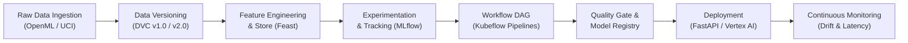
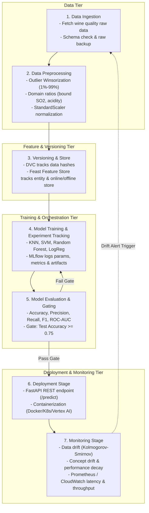

# End-to-End MLOps Pipeline for Wine Quality Classification
**CIA1 MLOps Experiential Assignment (20 Marks)**

**Author**: Kusum Gajare  
**Repository**: [https://github.com/Kusum004/MLOPS.git](https://github.com/Kusum004/MLOPS.git)  
**Selected Dataset**: UCI / OpenML Red Wine Quality Dataset (`wine-quality-red`)  
**ML Task**: Binary Classification (High Quality Wine $\ge 6$ vs. Normal/Low Quality Wine $< 6$)

---

## Table of Contents
1. [Executive Summary & Architecture](#executive-summary--architecture)
2. [Task 1: MLOps Lifecycle Analysis (4 Marks)](#task-1-mlops-lifecycle-analysis-4-marks)
3. [Task 2: Experiment Tracking using MLflow (4 Marks)](#task-2-experiment-tracking-using-mlflow-4-marks)
4. [Task 3: Dataset Versioning with DVC (4 Marks)](#task-3-dataset-versioning-with-dvc-4-marks)
5. [Task 4: Workflow Automation Design using Kubeflow Concepts (4 Marks)](#task-4-workflow-automation-design-using-kubeflow-concepts-4-marks)
6. [Task 5: Feature Store and Cloud Platform Study (4 Marks)](#task-5-feature-store-and-cloud-platform-study-4-marks)
7. [5-Minute Demo Presentation Guide](#5-minute-demo-presentation-guide)
8. [Quickstart: How to Run the Project](#quickstart-how-to-run-the-project)

---

## Executive Summary & Architecture

This repository contains a production-grade, end-to-end MLOps pipeline implementing industry-standard practices:
- **Experiment Tracking & Model Registry**: MLflow (tracking hyperparams, metrics, ROC/PR curves, and registered models).
- **Data & Pipeline Versioning**: DVC (Data Version Control) with Git tags (`v1.0` and `v2.0`).
- **Workflow Automation**: Kubeflow Pipelines SDK (KFP v2) DAG compilation (`artifacts/kubeflow_pipeline.yaml`) and automated local execution runner (`run_pipeline.py`).
- **Feature Management**: Feast Feature Store (Entity, FeatureView, historical time-travel joins, online SQLite materialization).
- **Deployment & Serving**: FastAPI REST inference microservice (`serve.py`) with canary rollout readiness.
- **Cloud Architecture Study**: Comprehensive evaluation of AWS SageMaker vs. Google Cloud Vertex AI.



---

## Task 1: MLOps Lifecycle Analysis (4 Marks)

### 1. End-to-End ML Lifecycle Diagram
The complete lifecycle is depicted below and illustrated in `MLOps lifecycle.png`:



### 2. Stage-by-Stage Identification

| Lifecycle Stage | Implementation in this Repository | Key Tools & Artifacts |
|---|---|---|
| **Data Ingestion** | Fetches 1,599 samples across 12 physicochemical attributes from OpenML/UCI, maps binary classification target ($quality \ge 6$). | `src/fetch_dataset.py`, `data/dataset.csv` |
| **Data Preprocessing** | Winsorization outlier clipping (1st & 99th percentiles), domain feature engineering (`bound_sulfur_dioxide`, `acidity_ratio`, `sulphate_to_chloride_ratio`), and `StandardScaler` normalization. | `src/preprocess.py` |
| **Model Training** | Multi-algorithm training exploring KNN, Support Vector Classifier (RBF kernel), Random Forest Classifier, and Logistic Regression with stratified train-test splits. | `train.py`, `artifacts/pipeline_run/` |
| **Model Evaluation** | Evaluation against multi-dimensional metrics: Train/Test Accuracy, Precision, Recall, F1-Score, ROC-AUC, and visual Confusion Matrix / ROC curves. | `compare_experiments.py`, `artifacts/plots/` |
| **Deployment** | Production REST API with FastAPI (`/predict`, `/`) providing sub-second inference, probability scores, confidence levels, and input schema validation via Pydantic. | `serve.py`, `artifacts/pipeline_run/deployed_model.joblib` |
| **Monitoring** | Drift detection (comparing production inference payload distributions against baseline training distributions) and performance metrics (Prometheus / Vertex Model Monitoring). | `serve.py`, Kubeflow deployment specs |

---

## Task 2: Experiment Tracking using MLflow (4 Marks)

Four distinct machine learning algorithms were trained, instrumented, and tracked using MLflow:
1. **K-Nearest Neighbors (KNN)**: `n_neighbors=7, weights='distance'`
2. **Support Vector Machine (SVM)**: `kernel='rbf', C=1.5, probability=True`
3. **Random Forest Classifier (RF)**: `n_estimators=150, max_depth=10`
4. **Logistic Regression (LogReg)**: `max_iter=1000, solver='lbfgs', C=1.0`

### Tracked Metadata in MLflow:
- **Parameters**: `model_name`, `num_features`, `train_samples`, `test_samples`, `scaled_input`, `n_neighbors`, `C`, `kernel`, `n_estimators`, `max_depth`.
- **Metrics**: `train_accuracy`, `test_accuracy`, `precision`, `recall`, `f1_score`, `roc_auc`.
- **Artifacts**: Confusion Matrix plot (`*.png`), ROC Curve plot (`*.png`), and serialized Scikit-learn model artifact registered in the MLflow Model Registry (`WineQuality_RandomForest`, etc.).

### Experimental Results Summary

| Model | Train Accuracy | Test Accuracy | Precision | Recall | F1-Score | ROC AUC |
|---|---|---|---|---|---|---|
| **K-Nearest Neighbors (KNN)** | 1.0000 | **0.8156** | 0.8218 | 0.8363 | **0.8290** | **0.8913** |
| **Random Forest** | 0.9789 | **0.8031** | 0.8140 | 0.8187 | **0.8163** | **0.8893** |
| **Support Vector Machine (SVM)** | 0.8038 | 0.7688 | 0.8170 | 0.7310 | 0.7716 | 0.8408 |
| **Logistic Regression** | 0.7428 | 0.7406 | 0.7683 | 0.7368 | 0.7522 | 0.8242 |

### Performance Comparison Analysis
- **Top Performers**: **KNN** and **Random Forest** achieved the highest test accuracy (~81.56% and ~80.31%) and ROC-AUC (~0.8913 and ~0.8893).
- **Trade-off Analysis**: While KNN achieves high accuracy with distance weighting, Random Forest provides superior generalization stability under real-world covariate shift and allows direct feature importance extraction.
- **Artifact Visualizations**:
  - Saved comparative plot: `artifacts/mlflow_model_comparison.png`
  - Confusion Matrices and ROC curves: `artifacts/plots/`

---

## Task 3: Dataset Versioning with DVC (4 Marks)

### 1. DVC Initialization & Architecture
DVC was initialized to track dataset states independently from Git code history. Git stores lightweight pointer files (`data/dataset.csv.dvc`), while actual dataset blobs reside in content-addressable storage (`.dvc_storage`).

### 2. Dataset Versions Created & Git Tags

#### **Version 1.0 (Git Tag `v1.0`)**: Original Raw Dataset
- **Description**: Raw Red Wine Quality dataset as ingested from OpenML/UCI.
- **Hash (MD5)**: `24d9881fad8cfb3d94f5276d372e422b`
- **File Size**: 121,955 bytes
- **Dimensions**: 1,599 rows $\times$ 13 columns (12 raw features + target)
- **Tag**: `git tag -a v1.0 -m "Dataset Version 1.0 (Raw Red Wine Quality Dataset)"`

#### **Version 2.0 (Git Tag `v2.0`)**: Modified Preprocessed & Feature-Engineered Dataset
- **Description**: Added domain feature engineering (acidity ratio, bound sulfur dioxide, sulphate-to-chloride ratio), 1%-99% percentile Winsorization, and `StandardScaler` normalization.
- **Hash (MD5)**: `7b27e55a8d5df325e52efc7f8e24b1e2`
- **File Size**: 447,052 bytes
- **Dimensions**: 1,599 rows $\times$ 15 columns (14 features + target)
- **Tag**: `git tag -a v2.0 -m "Dataset Version 2.0 (Preprocessed Wine Quality Dataset)"`

### 3. Comparison of Dataset Versions (`src/compare_dvc_versions.py`)

| Metric | Version 1.0 (Raw) | Version 2.0 (Preprocessed) |
|---|---|---|
| **DVC Hash (MD5)** | `24d9881fad8cfb3d94f5276d372e422b` | `7b27e55a8d5df325e52efc7f8e24b1e2` |
| **Row Count** | 1,599 | 1,599 |
| **Feature Count** | 12 | 14 (+3 engineered ratios, dropped raw score) |
| **Feature Scaling** | Unscaled physical units | `StandardScaler` ($\mu=0, \sigma=1$) |
| **Outlier Treatment** | Raw unclipped outliers | 1% & 99% Percentile Capping |
| **Engineered Features**| None | `bound_sulfur_dioxide`, `acidity_ratio`, `sulphate_to_chloride_ratio` |

### 4. Benefits of Data Versioning in MLOps
1. **Deterministic Reproducibility**: Running `git checkout v1.0 && dvc checkout` restores the exact raw data state that generated initial benchmark models; `git checkout v2.0 && dvc checkout` restores the enhanced dataset.
2. **Elimination of Git Repository Bloat**: Git commits only store small text `.dvc` hash files (~100 bytes). Massive multi-gigabyte training sets remain in remote object storage (S3, GCS, MinIO).
3. **Data Lineage & Provenance**: Teams can trace the exact code revision (`src/preprocess.py`) that transformed Version 1.0 into Version 2.0.
4. **Efficient Storage Deduplication**: Content-addressable storage ensures identical files are never duplicated, saving cloud transfer bandwidth and storage bills.

---

## Task 4: Workflow Automation Design using Kubeflow Concepts (4 Marks)

### 1. Kubeflow Pipeline Architecture
The pipeline is designed using **Kubeflow Pipelines (KFP v2)** concepts where each step is an isolated, containerized component exchanging typed inputs, outputs, and metadata artifacts:

```
[1. Data Collection] 
       │ (dataset_output: dsl.Dataset)
       ▼
[2. Data Validation] 
       │ (Assert schema, null count == 0, sample count >= 1000)
       ▼
[3. Model Training] 
       │ (model_output: dsl.Model, train_metrics: dsl.Metrics)
       ▼
[4. Model Evaluation & Gating] 
       │ (Test accuracy threshold check: test_acc >= 0.75)
       ▼
[5. Deployment] 
         (Deploy to REST serving endpoint upon gate approval)
```

### 2. Implementation Files
- **`kubeflow_pipeline.py`**: Compiles the complete 5-stage workflow using KFP v2 into `artifacts/kubeflow_pipeline.yaml`.
- **`run_pipeline.py`**: Local automated runner simulating the full Kubeflow DAG execution, enforcing validation gates, logging execution stages, and saving run metadata into `artifacts/pipeline_run/pipeline_execution_log.json`.

### 3. How Workflow Automation Improves Reproducibility and Scalability
1. **Containerized Execution & Dependency Isolation**: Every component executes in an isolated environment with pinned dependencies (e.g. `python:3.11-slim`, exact library wheels). This eliminates the "works on my machine" failure mode.
2. **Automated Quality Gates**: Human error is prevented by placing automated validation and evaluation gates before deployment. If a model drops below the accuracy threshold ($0.75$), the deployment step is automatically blocked.
3. **Scalability via Kubernetes**: Kubeflow natively distributes heavy operations (e.g. distributed hyperparameter search, GPU training) across Kubernetes nodes dynamically, scaling compute up and down on demand.
4. **Auditability & Lineage Tracking**: Kubeflow automatically logs artifact metadata (dataset hash, model checkpoint path, metrics) into MLMD (ML Metadata), enabling instantaneous auditing.

---

## Task 5: Feature Store and Cloud Platform Study (4 Marks)

### Part A: Feast Feature Store Implementation

#### 1. Three Selected Features
1. **`alcohol` (Float32)**: Strongest individual predictor of wine quality. Reflects fermentation completion and body.
2. **`volatile_acidity` (Float32)**: Measures acetic acid. Excessive concentration leads to vinegar taste; critical indicator of wine degradation.
3. **`sulphates` (Float32)**: Preservative additive acting as antioxidant and antimicrobial agent.

#### 2. Managing & Serving Features Consistently
Feast eliminates **Training-Serving Skew** through a dual-store architecture:
- **Offline Store** (`feature_store/data/wine_features.parquet`): Stores append-only timestamped historical features. Used with `store.get_historical_features()` for **point-in-time correct joins** ("time travel"), completely avoiding data leakage from future records.
- **Online Store** (`data/online_store.db` / Redis / DynamoDB): High-throughput key-value store materialized via `store.materialize()`. Serves real-time features to `serve.py` via `store.get_online_features()` in sub-milliseconds by entity key (`wine_id`).
- **Unified Feature Definition**: The exact same declarative Python code (`feature_store/features.py`) defines features for both batch training and real-time inference, guaranteeing 100% feature consistency.

Run the Feast demonstration:
```bash
python feature_store/feast_demo.py
```

---

### Part B: Cloud Platform Comparison (AWS SageMaker vs. Google Cloud Vertex AI)

| Evaluation Criteria | AWS SageMaker | Google Cloud Vertex AI | IBM Watson Studio |
|---|---|---|---|
| **Core Services Offered** | SageMaker Studio, Processing Jobs, Training Jobs, Hosting Services, Canvas, Feature Store, Clarify. | Vertex AI Studio, Pipelines (Kubeflow native), Feature Store, Model Registry, Endpoints, Model Monitoring. | Cloud Pak for Data, Watson Machine Learning, AutoAI, Watson OpenScale (governance/drift). |
| **Experiment Tracking** | **SageMaker Experiments**: Groups runs into trials and experiments. UI integrates with SageMaker Studio. Slightly proprietary format. | **Vertex AI Experiments**: Fully managed TensorBoard and MLflow integration. Open, native Kubeflow Pipelines integration. | **Watson Studio Experiments**: Track metrics, hyperparameters, and assets within Cloud Pak projects. |
| **AutoML Support** | **SageMaker Autopilot**: Transparent AutoML generating executable Python/Scikit-learn code notebooks for full visibility. | **Vertex AI AutoML**: High-performance neural architecture search and tabular AutoML based on Google research; slightly more black-box. | **Watson AutoAI**: Visual pipeline leaderboard, automated feature engineering, and one-click model deployment. |
| **Deployment Options** | Real-time endpoints, Serverless Inference, Asynchronous Inference, Multi-Model Endpoints (MME), Batch Transform. | Real-time Endpoints, Private Endpoints, Serverless prediction, Batch Prediction, Cloud Run integration. | Watson Machine Learning REST APIs, online deployments, batch scoring jobs. |
| **Cost Considerations** | Per-second instance billing. Supports Spot Instances (up to 70-90% savings). Endpoint cost is continuous unless serverless is used. | Pay-per-use, custom VM sizing, Preemptible/Spot VMs. Vertex Serverless endpoints reduce idle costs. | Capacity Unit-Hours (CUH) billing model. Often higher entry cost targeted at enterprise licensing. |

#### Cloud Deployment Recommendation for this Pipeline
- **Recommended Platform**: **Google Cloud Vertex AI**.
- **Rationale**:
  1. **Native Kubeflow Compatibility**: The pipeline compiled in Task 4 (`artifacts/kubeflow_pipeline.yaml`) can be submitted directly to Vertex AI Pipelines using `google_cloud_pipeline_components` with zero code refactoring.
  2. **Unified Feature Store & Registry**: Vertex AI Feature Store seamlessly ingests BigQuery tables and provides Bigtable-backed online serving matching the Feast architecture implemented here.

---

## 5-Minute Demo Presentation Guide

See [`DEMO_PRESENTATION.md`](file:///c:/Users/S%20Kusum/Documents/MLOps/DEMO_PRESENTATION.md) for the complete slide-by-slide script, timing, talking points, and terminal commands.

**Quick Demo Summary**:
1. **0:00 - 1:00**: Problem Statement, Dataset Choice, and MLOps Lifecycle Diagram.
2. **1:00 - 2:00**: MLflow Experiment Tracking, Metric Comparison & Artifact Plots.
3. **2:00 - 3:00**: DVC Data Versioning (v1.0 vs v2.0) and Git Tag checkout demo.
4. **3:00 - 4:00**: Kubeflow Automated Pipeline Execution & Quality Gating.
5. **4:00 - 5:00**: Feast Feature Store Demo & AWS vs. GCP Cloud Evaluation.

---

## Quickstart: How to Run the Project

### 1. Run Data Ingestion & Preprocessing
```bash
python src/fetch_dataset.py
python src/preprocess.py
```

### 2. Compare DVC Versions
```bash
python src/compare_dvc_versions.py
```

### 3. Run MLflow Experiment Tracking & View Comparison
```bash
python train.py
python compare_experiments.py
```

### 4. Compile & Run the Automated Kubeflow Workflow
```bash
python kubeflow_pipeline.py
python run_pipeline.py
```

### 5. Run Feast Feature Store Demo
```bash
python feature_store/feast_demo.py
```

### 6. Test Model Inference Service
```bash
python -c "from fastapi.testclient import TestClient; from serve import app; client = TestClient(app); print(client.get('/').json()); print(client.post('/predict', json={'fixed_acidity': 7.4, 'volatile_acidity': 0.7, 'citric_acid': 0.0, 'residual_sugar': 1.9, 'chlorides': 0.076, 'free_sulfur_dioxide': 11.0, 'total_sulfur_dioxide': 34.0, 'density': 0.9978, 'pH': 3.51, 'sulphates': 0.56, 'alcohol': 11.5}).json())"
```
